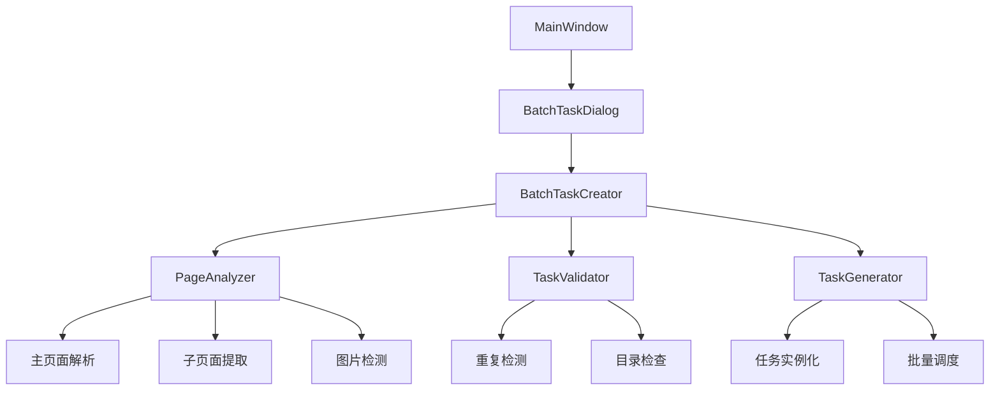
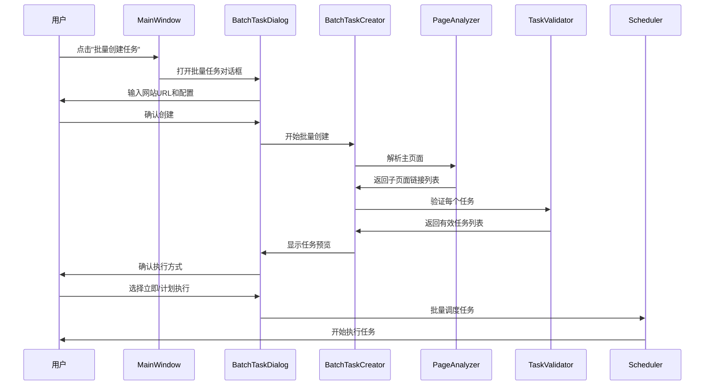
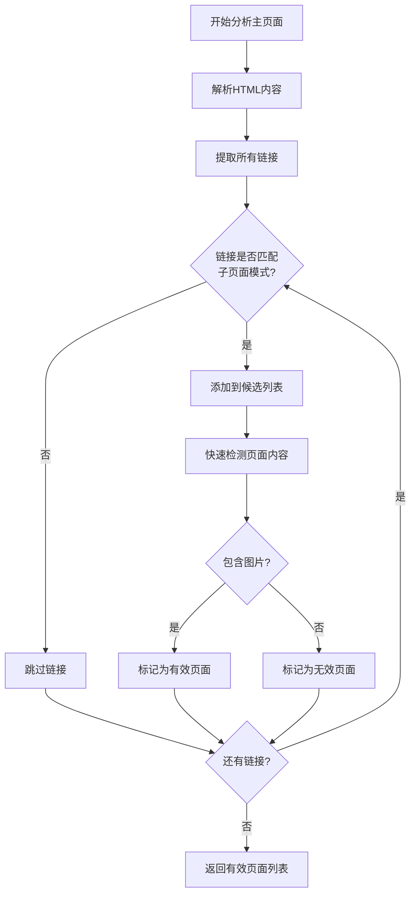
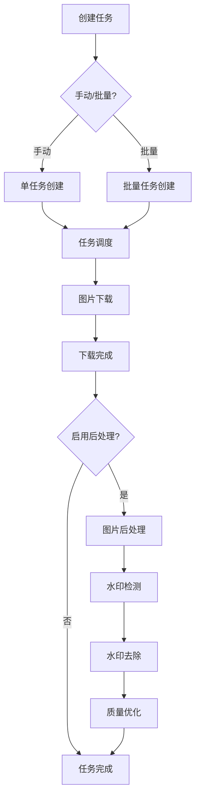

# 自动图像任务创建功能设计文档

## 1. 概述

本功能是对现有图片下载器的重要增强，在保留原有手动创建任务功能的基础上，新增批量任务创建能力。系统将实现从指定网站页面（如 `http://a1.876512.xyz/new.html`）自动分析和批量创建下载任务，智能解析主页面，提取所有包含图片的子页面链接，为每个子页面自动创建独立的下载任务，并支持重复任务检测、批量执行控制等高级功能。

### 功能定位
- **手动创建任务**：保留现有功能，用于精确控制单个下载任务
- **批量创建任务**：新增功能，用于从网站主页面批量生成多个下载任务
- **未来扩展**：为后续图片处理功能（如自动去除水印）提供架构基础

### 核心价值
- **功能并存**：手动和批量创建功能并存，满足不同使用场景
- **自动化任务创建**：从手动逐个创建任务扩展为一键批量创建
- **智能重复检测**：避免重复下载，节省存储空间和网络带宽  
- **批量执行控制**：支持立即执行或计划执行的灵活调度
- **用户确认机制**：在执行前提供任务预览和确认环节
- **可扩展架构**：为后续图片后处理功能预留接口

## 2. 技术架构

### 2.1 核心组件设计



### 2.2 数据流架构



## 3. 功能模块详细设计

### 3.1 批量任务创建器 (BatchTaskCreator)

**职责**：协调整个批量任务创建流程

```python
class BatchTaskCreator:
    def __init__(self, config, scheduler)
    def create_batch_tasks(self, main_url, options) -> List[DownloadTask]
    def analyze_main_page(self, url) -> List[str]
    def validate_tasks(self, task_candidates) -> List[DownloadTask]
    def preview_tasks(self, tasks) -> Dict[str, Any]
```

**核心方法**：
- `create_batch_tasks()`: 主入口方法，协调整个创建流程
- `analyze_main_page()`: 分析主页面，提取子页面链接
- `validate_tasks()`: 验证任务有效性，去除重复
- `preview_tasks()`: 生成任务预览信息供用户确认

### 3.2 页面分析器增强 (PageAnalyzer)

**现有组件增强**：基于现有 `WebPageParser` 类扩展

**新增方法**：
```python
def extract_sub_page_links(self, url, pattern_filters=None) -> List[str]
def detect_image_pages(self, urls) -> Dict[str, PageImageInfo]
def analyze_page_structure(self, url) -> PageStructure
```

**分析策略**：
1. **链接模式识别**：识别如 `Xiuren33895.html` 的编号模式
2. **图片页面检测**：快速检测页面是否包含图片内容
3. **智能过滤**：排除导航、索引等非内容页面

### 3.3 任务验证器 (TaskValidator)

**职责**：验证任务合法性，防止重复创建

```python
class TaskValidator:
    def __init__(self, file_manager, existing_tasks)
    def validate_task(self, task_candidate) -> ValidationResult
    def check_existing_directory(self, url) -> DirectoryStatus
    def check_duplicate_task(self, url) -> bool
    def estimate_task_size(self, url) -> TaskEstimate
```

**验证规则**：
1. **目录重复检测**：检查是否已存在相同的下载目录
2. **任务重复检测**：检查是否已有相同URL的活跃任务
3. **网络可达性**：验证页面URL是否可访问
4. **内容有效性**：确认页面确实包含可下载的图片

### 3.4 批量任务对话框 (BatchTaskDialog)

**界面布局**：

```
┌─ 批量任务创建 ────────────────────────────────┐
│ 主页面URL: [________________________] [分析] │
│                                              │
│ ┌─ 分析选项 ─────────────────────────────────┐ │
│ │ □ 检测图片内容  □ 跳过已下载目录            │ │
│ │ 最大页面数: [100]  超时设置: [30秒]        │ │
│ └─────────────────────────────────────────┘ │
│                                              │
│ ┌─ 任务预览 ─────────────────────────────────┐ │
│ │ 发现页面: 45个  有效任务: 42个  跳过: 3个   │ │
│ │ [任务列表 - 表格形式显示]                  │ │
│ │ ☑ Xiuren33895  ☑ Xiuren33896  ☐ Xiuren... │ │
│ └─────────────────────────────────────────┘ │
│                                              │
│ ┌─ 执行选项 ─────────────────────────────────┐ │
│ │ ○ 立即执行全部  ○ 计划执行: [日期] [时间]  │ │
│ │ ○ 仅创建任务，手动执行                    │ │
│ └─────────────────────────────────────────┘ │
│                                              │
│    [全选] [全不选] [反选]  [创建] [取消]     │
└──────────────────────────────────────────────┘
```

**用户交互流程**：
1. 输入主页面URL，点击"分析"按钮
2. 系统显示分析进度，完成后展示任务预览
3. 用户可选择/取消特定任务
4. 选择执行方式（立即/计划/仅创建）
5. 确认创建，系统批量生成任务

## 4. 核心算法设计

### 4.1 子页面智能提取算法



**模式识别规则**：
- 编号模式：`/Xiuren/Xiuren(\d+)\.html`
- 路径相似性：同目录下的相似文件名
- 分页模式：包含page、p等参数的链接

### 4.2 重复任务检测算法

```python
def check_duplicate_task(self, url: str) -> DuplicateCheckResult:
    """
    多层次重复检测：
    1. URL完全匹配检测
    2. 目录名匹配检测  
    3. 内容哈希匹配检测（可选）
    """
    # Level 1: 精确URL匹配
    if url in self.existing_task_urls:
        return DuplicateCheckResult(True, "URL_EXACT_MATCH")
    
    # Level 2: 目录名匹配
    directory_name = self.generate_directory_name(url)
    if self.file_manager.directory_exists(directory_name):
        return DuplicateCheckResult(True, "DIRECTORY_EXISTS")
    
    # Level 3: 相似度匹配
    similarity_score = self.calculate_url_similarity(url)
    if similarity_score > 0.9:
        return DuplicateCheckResult(True, "HIGH_SIMILARITY")
    
    return DuplicateCheckResult(False, "UNIQUE")
```

### 4.3 批量任务调度算法

```python
def schedule_batch_tasks(self, tasks: List[DownloadTask], 
                        mode: ScheduleMode) -> BatchScheduleResult:
    """
    批量任务智能调度：
    - 考虑系统资源限制
    - 实现优雅的任务分批
    - 支持优先级调度
    """
    if mode == ScheduleMode.IMMEDIATE:
        # 立即执行模式：分批启动，避免系统过载
        return self._schedule_immediate_batch(tasks)
    elif mode == ScheduleMode.SCHEDULED:
        # 计划执行模式：设置统一的开始时间
        return self._schedule_timed_batch(tasks)
    else:
        # 仅创建模式：只创建不调度
        return self._create_tasks_only(tasks)
```

## 5. 数据模型扩展

### 5.1 批量任务创建配置

```python
@dataclass
class BatchTaskConfig:
    """批量任务创建配置"""
    main_url: str                           # 主页面URL
    max_pages: int = 100                    # 最大页面数
    timeout_seconds: int = 30               # 超时设置
    skip_existing: bool = True              # 跳过已存在目录
    detect_images: bool = True              # 检测图片内容
    url_patterns: List[str] = field(default_factory=list)  # URL过滤模式
    concurrent_analysis: int = 5            # 并发分析数
```

### 5.2 批量创建结果

```python
@dataclass
class BatchCreationResult:
    """批量创建结果"""
    total_found: int                        # 发现的页面总数
    valid_tasks: int                        # 有效任务数
    duplicate_skipped: int                  # 跳过的重复任务
    failed_analysis: int                    # 分析失败的页面
    created_tasks: List[DownloadTask]       # 创建的任务列表
    execution_mode: str                     # 执行模式
    scheduled_time: Optional[datetime] = None  # 计划执行时间
```

### 5.3 任务预览信息

```python
@dataclass  
class TaskPreviewInfo:
    """任务预览信息"""
    url: str                                # 页面URL
    estimated_images: int                   # 预估图片数
    estimated_size: str                     # 预估大小
    directory_name: str                     # 目录名
    status: str                             # 状态（新建/重复/错误）
    selected: bool = True                   # 是否选中
```

## 6. 用户界面增强

### 6.1 主窗口工具栏扩展

在现有工具栏添加新按钮，保持手动创建和批量创建功能并存：
```python
# 任务创建按钮组
ttk.Button(left_buttons, text="新建任务", command=self.new_task).pack(side=tk.LEFT, padx=(0, 5))
ttk.Button(left_buttons, text="批量创建", command=self.open_batch_creator).pack(side=tk.LEFT, padx=(0, 5))
```

### 6.2 批量任务状态显示

扩展状态栏显示批量任务信息：
```python
self.batch_stats_var = tk.StringVar(value="批量任务: 0个排队")
ttk.Label(info_frame, textvariable=self.batch_stats_var).pack(side=tk.LEFT, padx=(20, 0))
```

### 6.3 进度显示增强

为批量创建过程添加专门的进度对话框：
- 实时显示分析进度
- 显示当前正在分析的页面
- 提供取消分析的选项
- 显示网络错误和超时信息

## 7. 错误处理与异常情况

### 7.1 网络异常处理

```python
class NetworkErrorHandler:
    def handle_connection_timeout(self, url: str) -> bool:
        """处理连接超时"""
        # 重试机制，最多3次
        # 记录失败URL供后续重试
        
    def handle_page_not_found(self, url: str) -> bool:
        """处理页面404错误"""
        # 标记为无效页面
        # 从候选列表中移除
        
    def handle_access_denied(self, url: str) -> bool:
        """处理访问被拒绝"""
        # 可能需要更新User-Agent
        # 或实现简单的反爬策略
```

### 7.2 数据验证异常

- **URL格式错误**：提示用户检查URL格式
- **页面结构异常**：记录错误页面，继续处理其他页面
- **权限不足**：检查下载目录的写权限
- **磁盘空间不足**：估算所需空间，提前警告

### 7.3 用户操作异常

- **取消操作**：优雅地停止分析过程
- **重复操作**：防止用户重复点击创建按钮
- **数据丢失**：在对话框关闭前保存用户选择

## 8. 性能优化策略

### 8.1 并发分析优化

```python
async def analyze_pages_concurrently(self, urls: List[str]) -> List[PageAnalysisResult]:
    """
    并发分析页面：
    - 使用连接池复用HTTP连接
    - 限制并发数避免过载
    - 实现优雅的超时处理
    """
    semaphore = asyncio.Semaphore(self.concurrent_analysis)
    tasks = [self._analyze_single_page(url, semaphore) for url in urls]
    return await asyncio.gather(*tasks, return_exceptions=True)
```

### 8.2 内存使用优化

- **流式处理**：避免一次性加载所有页面内容
- **结果缓存**：缓存分析结果，避免重复计算
- **及时清理**：分析完成后及时释放HTML内容

### 8.3 用户体验优化

- **渐进式显示**：分析一个显示一个，不等待全部完成
- **智能预估**：基于已分析页面预估总体情况
- **响应式取消**：用户取消操作后快速响应

## 9. 集成测试策略

### 9.1 功能测试

```python
class TestBatchTaskCreation:
    def test_main_page_analysis(self):
        """测试主页面分析功能"""
        
    def test_duplicate_detection(self):
        """测试重复任务检测"""
        
    def test_batch_scheduling(self):
        """测试批量调度功能"""
        
    def test_error_handling(self):
        """测试错误处理机制"""
```

### 9.2 性能测试

- **大量页面处理**：测试处理100+页面的性能
- **并发限制测试**：验证并发控制的有效性
- **内存占用测试**：确保内存使用在合理范围
- **网络异常测试**：模拟各种网络异常情况

### 9.3 用户界面测试

- **响应性测试**：确保UI在长时间操作中保持响应
- **数据一致性测试**：验证界面显示与实际数据的一致性
- **异常恢复测试**：测试异常情况下的界面恢复能力

## 10. 界面优化与美化

### 10.1 主窗口界面美化

**工具栏优化**：
```python
def _create_toolbar(self, parent):
    """创建优化后的工具栏"""
    # 主工具栏容器
    toolbar_frame = ttk.Frame(parent)
    toolbar_frame.pack(fill=tk.X, pady=(0, 10))
    
    # 任务操作组
    task_group = ttk.LabelFrame(toolbar_frame, text="任务操作", padding=5)
    task_group.pack(side=tk.LEFT, fill=tk.Y, padx=(0, 10))
    
    # 使用统一的按钮样式
    button_style = {"width": 12, "padding": 2}
    
    ttk.Button(task_group, text="新建任务", command=self.new_task, **button_style).grid(row=0, column=0, padx=2, pady=2)
    ttk.Button(task_group, text="批量创建", command=self.open_batch_creator, **button_style).grid(row=0, column=1, padx=2, pady=2)
    ttk.Button(task_group, text="开始任务", command=self.start_selected_task, **button_style).grid(row=1, column=0, padx=2, pady=2)
    ttk.Button(task_group, text="重新下载", command=self.restart_selected_task, **button_style).grid(row=1, column=1, padx=2, pady=2)
    
    # 管理操作组
    manage_group = ttk.LabelFrame(toolbar_frame, text="管理操作", padding=5)
    manage_group.pack(side=tk.LEFT, fill=tk.Y, padx=(0, 10))
    
    ttk.Button(manage_group, text="取消任务", command=self.cancel_selected_task, **button_style).grid(row=0, column=0, padx=2, pady=2)
    ttk.Button(manage_group, text="删除任务", command=self.delete_selected_task, **button_style).grid(row=0, column=1, padx=2, pady=2)
    ttk.Button(manage_group, text="清理文件", command=self.cleanup_test_files, **button_style).grid(row=1, column=0, padx=2, pady=2)
    
    # 查看操作组
    view_group = ttk.LabelFrame(toolbar_frame, text="查看操作", padding=5)
    view_group.pack(side=tk.RIGHT, fill=tk.Y)
    
    ttk.Button(view_group, text="图片预览", command=self.preview_images, **button_style).grid(row=0, column=0, padx=2, pady=2)
    ttk.Button(view_group, text="打开目录", command=self.open_download_folder, **button_style).grid(row=0, column=1, padx=2, pady=2)
    ttk.Button(view_group, text="设置", command=self.open_settings, **button_style).grid(row=1, column=0, padx=2, pady=2)
```

**任务列表美化**：
```python
def _create_task_list(self, parent):
    """创建美化的任务列表"""
    list_frame = ttk.LabelFrame(parent, text="任务列表", padding=5)
    list_frame.pack(fill=tk.BOTH, expand=True, pady=(0, 10))
    
    # 任务列表容器
    tree_container = ttk.Frame(list_frame)
    tree_container.pack(fill=tk.BOTH, expand=True)
    
    # 定义列
    columns = ('name', 'status', 'progress', 'images', 'size', 'speed')
    self.task_tree = ttk.Treeview(tree_container, columns=columns, show='headings', height=12)
    
    # 设置列标题和宽度
    column_config = {
        'name': ('任务名称', 250),
        'status': ('状态', 80),
        'progress': ('进度', 90),
        'images': ('图片数', 80),
        'size': ('大小', 90),
        'speed': ('速度', 90)
    }
    
    for col_id, (title, width) in column_config.items():
        self.task_tree.heading(col_id, text=title)
        self.task_tree.column(col_id, width=width, minwidth=width//2)
    
    # 添加双滚动条
    v_scrollbar = ttk.Scrollbar(tree_container, orient=tk.VERTICAL, command=self.task_tree.yview)
    h_scrollbar = ttk.Scrollbar(tree_container, orient=tk.HORIZONTAL, command=self.task_tree.xview)
    self.task_tree.configure(yscrollcommand=v_scrollbar.set, xscrollcommand=h_scrollbar.set)
    
    # 布局
    self.task_tree.grid(row=0, column=0, sticky="nsew")
    v_scrollbar.grid(row=0, column=1, sticky="ns")
    h_scrollbar.grid(row=1, column=0, sticky="ew")
    
    tree_container.grid_rowconfigure(0, weight=1)
    tree_container.grid_columnconfigure(0, weight=1)
```

### 10.2 批量任务对话框美化

**响应式布局设计**：
```python
class BatchTaskDialog:
    def _create_widgets(self):
        """创建美化的界面控件"""
        # 设置对话框最小尺寸，确保所有按钮可见
        self.dialog.minsize(800, 700)
        self.dialog.geometry("900x750")
        
        # 主容器使用网格布局
        main_container = ttk.Frame(self.dialog, padding=15)
        main_container.pack(fill=tk.BOTH, expand=True)
        
        # 输入区域
        self._create_input_section(main_container)
        
        # 分析进度区域
        self._create_progress_section(main_container)
        
        # 任务预览区域
        self._create_preview_section(main_container)
        
        # 执行选项区域
        self._create_execution_section(main_container)
        
        # 按钮区域 - 确保充足的空间
        self._create_button_section(main_container)
    
    def _create_button_section(self, parent):
        """创建按钮区域，确保所有按钮可见"""
        button_frame = ttk.Frame(parent)
        button_frame.pack(fill=tk.X, pady=(20, 0))
        
        # 分隔线
        ttk.Separator(button_frame, orient=tk.HORIZONTAL).pack(fill=tk.X, pady=(0, 15))
        
        # 按钮容器，使用足够的高度
        button_container = ttk.Frame(button_frame, height=80)
        button_container.pack(fill=tk.X)
        button_container.pack_propagate(False)  # 固定高度
        
        # 左侧批量操作按钮
        left_frame = ttk.Frame(button_container)
        left_frame.pack(side=tk.LEFT, anchor="w")
        
        ttk.Button(left_frame, text="全选", command=self.select_all, width=8).pack(side=tk.LEFT, padx=(0, 5))
        ttk.Button(left_frame, text="全不选", command=self.select_none, width=8).pack(side=tk.LEFT, padx=(0, 5))
        ttk.Button(left_frame, text="反选", command=self.invert_selection, width=8).pack(side=tk.LEFT, padx=(0, 10))
        
        # 右侧主要操作按钮
        right_frame = ttk.Frame(button_container)
        right_frame.pack(side=tk.RIGHT, anchor="e")
        
        # 使用更大的按钮尺寸确保可见性
        button_style = {"width": 12, "height": 2}
        ttk.Button(right_frame, text="开始分析", command=self.start_analysis, **button_style).pack(side=tk.LEFT, padx=(0, 10))
        ttk.Button(right_frame, text="创建任务", command=self.create_tasks, **button_style).pack(side=tk.LEFT, padx=(0, 10))
        ttk.Button(right_frame, text="取消", command=self.cancel, **button_style).pack(side=tk.LEFT)
```

### 10.3 测试文件清理功能

**自动清理机制**：
```python
class TestFileManager:
    """测试文件管理器"""
    
    def __init__(self, project_root):
        self.project_root = project_root
        self.logger = logging.getLogger(__name__)
        
        # 定义需要清理的测试文件模式
        self.cleanup_patterns = [
            "test_*.py",
            "test_*.log", 
            "*.log",
            "*_test.py",
            "BUTTON_TROUBLESHOOTING.md",
            "DIRECTORY_REUSE_SUMMARY.md",
            "DOWNLOAD_FIXES.md",
            "FINAL_IMPROVEMENTS.md",
            "FIX_NOTES.md",
            "INSTANT_EXECUTION_FIX.md",
            "UI_IMPROVEMENTS.md"
        ]
        
        # 保留的重要文件
        self.keep_files = [
            "README.md",
            "USAGE.md",
            "requirements.txt",
            "config.json",
            "main.py",
            "monitor.py",
            "start.bat"
        ]
    
    def scan_test_files(self) -> Dict[str, List[str]]:
        """扫描测试文件"""
        result = {
            "log_files": [],
            "test_scripts": [],
            "temp_docs": [],
            "total_size": 0
        }
        
        for pattern in self.cleanup_patterns:
            for file_path in glob.glob(os.path.join(self.project_root, pattern)):
                if os.path.basename(file_path) not in self.keep_files:
                    file_size = os.path.getsize(file_path)
                    result["total_size"] += file_size
                    
                    if file_path.endswith('.log'):
                        result["log_files"].append((file_path, file_size))
                    elif file_path.endswith('.py'):
                        result["test_scripts"].append((file_path, file_size))
                    elif file_path.endswith('.md'):
                        result["temp_docs"].append((file_path, file_size))
        
        return result
    
    def cleanup_test_files(self, file_categories: List[str] = None) -> CleanupResult:
        """清理测试文件"""
        if file_categories is None:
            file_categories = ["log_files", "test_scripts", "temp_docs"]
        
        scan_result = self.scan_test_files()
        cleaned_files = []
        total_freed = 0
        
        for category in file_categories:
            for file_path, file_size in scan_result.get(category, []):
                try:
                    os.remove(file_path)
                    cleaned_files.append(file_path)
                    total_freed += file_size
                    self.logger.info(f"已删除: {file_path} ({file_size} bytes)")
                except Exception as e:
                    self.logger.error(f"删除失败 {file_path}: {e}")
        
        return CleanupResult(
            cleaned_count=len(cleaned_files),
            freed_space=total_freed,
            cleaned_files=cleaned_files
        )
```

**界面集成的清理功能**：
```python
def cleanup_test_files(self):
    """清理测试文件的GUI方法"""
    from .cleanup_dialog import CleanupDialog
    
    dialog = CleanupDialog(self.root, self.project_root)
    result = dialog.show()
    
    if result and result.get('confirmed'):
        try:
            cleanup_manager = TestFileManager(self.project_root)
            cleanup_result = cleanup_manager.cleanup_test_files(result['categories'])
            
            # 显示清理结果
            freed_mb = cleanup_result.freed_space / (1024 * 1024)
            message = (f"清理完成！\n"
                      f"删除文件: {cleanup_result.cleaned_count} 个\n"
                      f"释放空间: {freed_mb:.2f} MB")
            
            messagebox.showinfo("清理完成", message)
            
        except Exception as e:
            self.logger.error(f"清理测试文件失败: {e}")
            messagebox.showerror("错误", f"清理失败: {e}")
```

### 10.4 清理对话框设计

```python
class CleanupDialog:
    """清理文件对话框"""
    
    def __init__(self, parent, project_root):
        self.parent = parent
        self.project_root = project_root
        self.result = None
        
        # 创建对话框
        self.dialog = tk.Toplevel(parent)
        self.dialog.title("清理测试文件")
        self.dialog.geometry("600x500")
        self.dialog.resizable(True, True)
        self.dialog.transient(parent)
        self.dialog.grab_set()
        
        self._create_widgets()
        self._scan_files()
    
    def _create_widgets(self):
        """创建界面控件"""
        main_frame = ttk.Frame(self.dialog, padding=10)
        main_frame.pack(fill=tk.BOTH, expand=True)
        
        # 说明文字
        info_label = ttk.Label(main_frame, 
            text="扫描到以下测试文件，选择要清理的类型：",
            font=('Arial', 10))
        info_label.pack(anchor=tk.W, pady=(0, 10))
        
        # 文件列表框架
        list_frame = ttk.Frame(main_frame)
        list_frame.pack(fill=tk.BOTH, expand=True, pady=(0, 10))
        
        # 创建分类复选框和文件列表
        self.category_vars = {}
        self.file_lists = {}
        
        categories = [
            ('log_files', '日志文件 (*.log)', 'red'),
            ('test_scripts', '测试脚本 (test_*.py)', 'orange'),  
            ('temp_docs', '临时文档 (*.md)', 'blue')
        ]
        
        for i, (key, label, color) in enumerate(categories):
            # 分类框架
            cat_frame = ttk.LabelFrame(list_frame, text=label, padding=5)
            cat_frame.pack(fill=tk.BOTH, expand=True, pady=(0, 5))
            
            # 复选框
            self.category_vars[key] = tk.BooleanVar(value=True)
            ttk.Checkbutton(cat_frame, text=f"清理{label}", 
                           variable=self.category_vars[key]).pack(anchor=tk.W)
            
            # 文件列表
            list_container = ttk.Frame(cat_frame)
            list_container.pack(fill=tk.BOTH, expand=True, pady=(5, 0))
            
            listbox = tk.Listbox(list_container, height=4, font=('Consolas', 9))
            scrollbar = ttk.Scrollbar(list_container, orient=tk.VERTICAL, command=listbox.yview)
            listbox.configure(yscrollcommand=scrollbar.set)
            
            listbox.pack(side=tk.LEFT, fill=tk.BOTH, expand=True)
            scrollbar.pack(side=tk.RIGHT, fill=tk.Y)
            
            self.file_lists[key] = listbox
        
        # 按钮区域
        button_frame = ttk.Frame(main_frame)
        button_frame.pack(fill=tk.X, pady=(10, 0))
        
        ttk.Button(button_frame, text="全选", command=self.select_all).pack(side=tk.LEFT, padx=(0, 5))
        ttk.Button(button_frame, text="全不选", command=self.select_none).pack(side=tk.LEFT, padx=(0, 10))
        ttk.Button(button_frame, text="开始清理", command=self.confirm_cleanup).pack(side=tk.RIGHT, padx=(5, 0))
        ttk.Button(button_frame, text="取消", command=self.cancel).pack(side=tk.RIGHT)
```

### 10.5 任务状态优化

**遵循任务创建和调度规范**：
```python
def schedule_batch_tasks(self, tasks: List[DownloadTask], mode: ScheduleMode):
    """批量任务调度，确保快速响应"""
    # 设置调度器检查间隔为0.5秒，提升响应速度
    original_interval = self.scheduler.check_interval
    self.scheduler.check_interval = 0.5
    
    try:
        for task in tasks:
            if mode == ScheduleMode.IMMEDIATE:
                # 立即执行任务
                self.scheduler.schedule_task(task, priority=0)
                self.logger.info(f"任务已调度立即执行: {task.name}")
            elif mode == ScheduleMode.SCHEDULED:
                # 计划执行任务
                task.scheduled_time = self.scheduled_time
                self.scheduler.schedule_task(task, priority=1)
                self.logger.info(f"任务已调度计划执行: {task.name} 于 {task.scheduled_time}")
            else:
                # 仅创建任务
                with self.scheduler.lock:
                    self.scheduler.tasks[task.id] = task
                self.logger.info(f"任务已创建: {task.name}")
        
        # 根据执行模式提供明确的成功提示
        if mode == ScheduleMode.IMMEDIATE:
            success_msg = f"成功创建 {len(tasks)} 个任务并开始立即执行"
        elif mode == ScheduleMode.SCHEDULED:
            success_msg = f"成功创建 {len(tasks)} 个任务，计划于 {self.scheduled_time.strftime('%Y-%m-%d %H:%M')} 执行"
        else:
            success_msg = f"成功创建 {len(tasks)} 个任务，可手动启动执行"
        
        messagebox.showinfo("创建成功", success_msg)
        
    finally:
        # 恢复原始检查间隔
        self.scheduler.check_interval = original_interval
```

## 11. 未来功能扩展规划

### 11.1 图片后处理功能架构

**自动去除水印功能设计**：
```python
class ImagePostProcessor:
    """图片后处理器"""
    
    def __init__(self, config):
        self.config = config
        self.watermark_detector = WatermarkDetector()
        self.watermark_remover = WatermarkRemover()
    
    def process_downloaded_images(self, task: DownloadTask) -> ProcessingResult:
        """处理已下载的图片"""
        # 自动检测和去除水印
        # 图片质量优化
        # 格式转换
        pass
    
    def detect_watermarks(self, image_path: str) -> WatermarkInfo:
        """检测图片中的水印"""
        pass
    
    def remove_watermark(self, image_path: str, watermark_info: WatermarkInfo) -> bool:
        """去除图片水印"""
        pass
```

**集成到现有任务流程**：
```python
class DownloadTask:
    # 现有字段...
    
    # 新增后处理相关字段
    enable_post_processing: bool = False
    post_processing_options: Dict[str, Any] = field(default_factory=dict)
    processed_images: int = 0
    processing_status: ProcessingStatus = ProcessingStatus.PENDING
```

**后处理配置选项**：
```python
@dataclass
class PostProcessingConfig:
    """后处理配置"""
    enable_watermark_removal: bool = False
    watermark_detection_sensitivity: float = 0.8
    preserve_original: bool = True
    output_format: str = "original"  # original, jpg, png
    quality_optimization: bool = False
    batch_processing: bool = True
```

### 11.2 任务流程扩展

**完整的任务生命周期**：


### 11.3 用户界面扩展

**后处理设置集成**：
```python
def _create_post_processing_section(self, parent):
    """创建后处理设置区域"""
    processing_frame = ttk.LabelFrame(parent, text="图片后处理（未来功能）", padding=10)
    processing_frame.pack(fill=tk.X, pady=(0, 10))
    
    # 启用后处理
    self.enable_processing_var = tk.BooleanVar()
    ttk.Checkbutton(
        processing_frame, 
        text="启用图片后处理", 
        variable=self.enable_processing_var,
        command=self.on_processing_toggle
    ).pack(anchor=tk.W)
    
    # 后处理选项框架
    self.processing_options_frame = ttk.Frame(processing_frame)
    self.processing_options_frame.pack(fill=tk.X, padx=(20, 0), pady=(5, 0))
    
    # 水印去除选项
    self.remove_watermark_var = tk.BooleanVar()
    ttk.Checkbutton(
        self.processing_options_frame,
        text="自动去除水印",
        variable=self.remove_watermark_var
    ).pack(anchor=tk.W)
    
    # 质量优化选项
    self.optimize_quality_var = tk.BooleanVar()
    ttk.Checkbutton(
        self.processing_options_frame,
        text="图片质量优化",
        variable=self.optimize_quality_var
    ).pack(anchor=tk.W)
    
    # 保留原图选项
    self.preserve_original_var = tk.BooleanVar(value=True)
    ttk.Checkbutton(
        self.processing_options_frame,
        text="保留原始图片",
        variable=self.preserve_original_var
    ).pack(anchor=tk.W)
    
    # 初始状态设置
    self.on_processing_toggle()
```

### 11.4 技术实现路径

**阶段一：基础架构**
- 完成批量任务创建功能
- 建立后处理模块接口
- 扩展任务数据模型

**阶段二：水印检测**
- 集成图像处理库（OpenCV、PIL）
- 实现水印模式识别算法
- 建立水印特征数据库

**阶段三：水印去除**
- 实现基于内容感知的修复算法
- 支持多种水印类型处理
- 优化处理速度和质量

**阶段四：批量处理**
- 多线程后处理支持
- 处理进度监控
- 批量操作优化

## 12. 部署和维护

### 11.1 配置管理

扩展现有配置文件支持批量任务参数：
```json
{
  "batch_task": {
    "max_concurrent_analysis": 5,
    "default_timeout": 30,
    "max_pages_per_batch": 100,
    "enable_duplicate_detection": true,
    "auto_skip_existing": true
  },
  "ui_settings": {
    "enable_auto_cleanup": true,
    "cleanup_on_startup": false,
    "button_min_width": 12,
    "window_min_size": [800, 600]
  }
}
```

### 11.2 日志和监控

```python
# 添加专门的批量任务日志记录
self.batch_logger = logging.getLogger('batch_task_creator')
self.batch_logger.info(f"开始批量分析: {main_url}")
self.batch_logger.info(f"发现页面数: {total_pages}, 有效任务: {valid_tasks}")

# 添加清理操作日志
self.cleanup_logger = logging.getLogger('file_cleanup')
self.cleanup_logger.info(f"开始清理测试文件: {scan_result['total_size']} bytes")
```

### 12.3 向后兼容性

- **完全保持现有手动任务创建功能不变**
- 批量创建作为独立的新增功能模块
- 后处理功能作为可选扩展，默认关闭
- 配置参数提供合理默认值
- 支持逐步迁移和功能开关
- 界面美化不影响现有功能的使用
- 新功能可独立开启/关闭，不影响核心下载功能